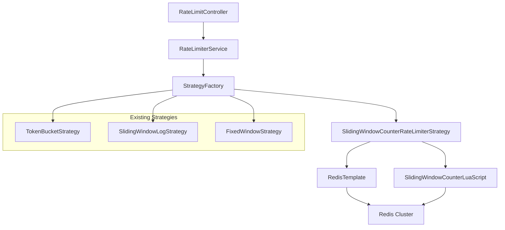
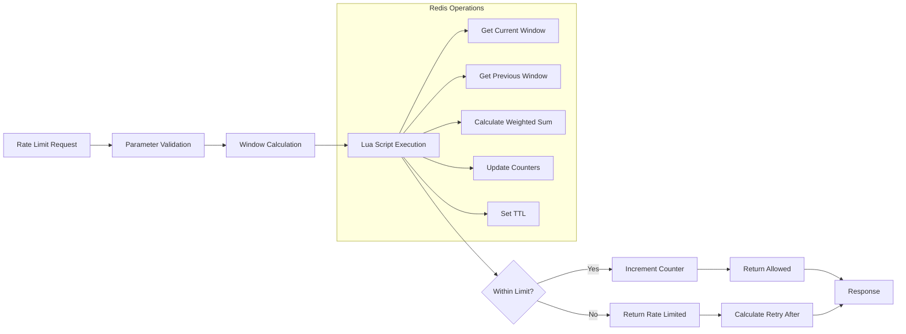
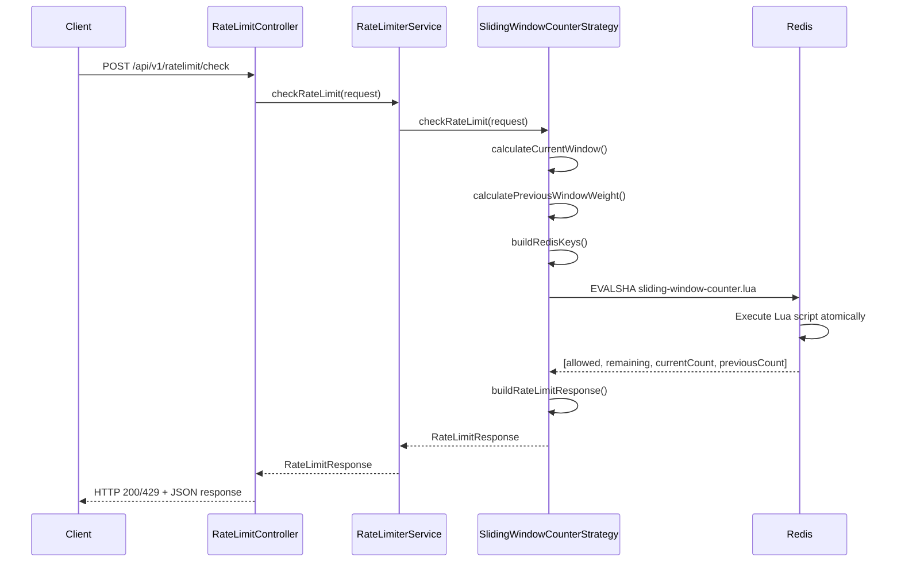
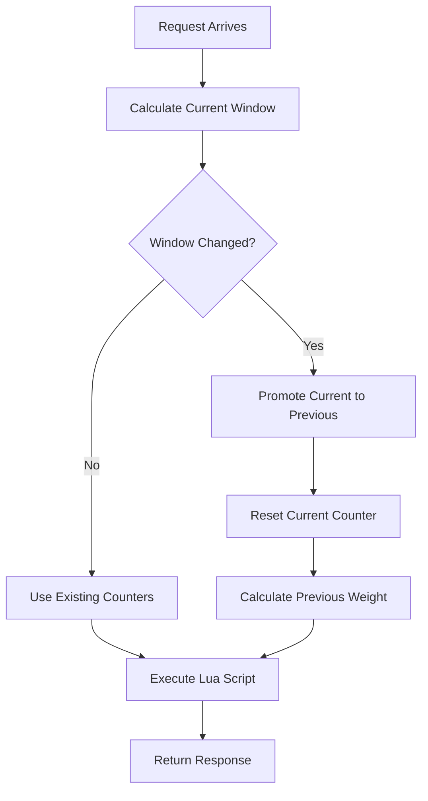

# Design Document: Sliding Window Counter Algorithm Implementation

## Overview

This design document specifies the implementation of the Sliding Window Counter rate limiting algorithm for the distributed rate limiter service. The algorithm provides memory-efficient approximate rate limiting by maintaining only two counters (current and previous window) and weighting the previous window's contribution based on time overlap. This approach achieves O(1) memory usage per key while providing good accuracy compared to the exact sliding window log approach.

## Architecture Design

### System Architecture Integration



### Data Flow Diagram



## Component Design

### SlidingWindowCounterRateLimiterStrategy

**Responsibilities:**
- Implement the sliding window counter algorithm logic
- Calculate window boundaries and time-based weights
- Execute Redis Lua script for atomic operations
- Handle error conditions and fail-open behavior

**Interface:**
```java
public class SlidingWindowCounterRateLimiterStrategy implements RateLimiterStrategy {
    
    @Override
    public RateLimitResponse checkRateLimit(RateLimitRequest request);
    
    private long calculateCurrentWindow(long currentTimeMillis, long windowSizeMillis);
    private double calculatePreviousWindowWeight(long currentTimeMillis, long windowSizeMillis);
    private Instant calculateResetTime(long currentWindow, long windowSizeMillis);
    private String buildCurrentWindowKey(String key);
    private String buildPreviousWindowKey(String key);
}
```

**Dependencies:**
- `RedisTemplate<String, String>` for Redis operations
- `ResourceLoader` for Lua script loading
- `MeterRegistry` for metrics collection
- `Clock` for time operations (testable)

### Lua Script Design

**Script Name:** `sliding-window-counter.lua`

**Input Parameters:**
1. `currentWindowKey` - Redis key for current window (includes window timestamp)
2. `previousWindowKey` - Redis key for previous window (includes window timestamp)  
3. `limit` - Rate limit threshold
4. `cost` - Request cost (typically 1)
5. `nowMillis` - Current timestamp in milliseconds
6. `windowSizeMillis` - Window size in milliseconds
7. `ttlSeconds` - TTL for counter keys

**Return Values:**
```lua
-- Returns array: [allowed, remaining, currentCount, previousCount, weight, retryAfterSeconds?]
-- allowed: 1 if request allowed, 0 if rate limited
-- remaining: number of requests remaining in current window
-- currentCount: current window counter value
-- previousCount: previous window counter value
-- weight: calculated weight factor for previous window (0.0 to 1.0)
-- retryAfterSeconds: seconds until next window (only when denied)
```

**Script Logic:**
```lua
local currentWindowKey = KEYS[1]
local previousWindowKey = KEYS[2]
local limit = tonumber(ARGV[1])
local cost = tonumber(ARGV[2])
local nowMillis = tonumber(ARGV[3])
local windowSizeMillis = tonumber(ARGV[4])
local ttlSeconds = tonumber(ARGV[5])

-- Get current and previous window counters (simple integers)
local currentCount = tonumber(redis.call('GET', currentWindowKey) or 0)
local previousCount = tonumber(redis.call('GET', previousWindowKey) or 0)

-- Calculate previous window weight based on time overlap
local currentWindowStart = math.floor(nowMillis / windowSizeMillis) * windowSizeMillis
local timeIntoCurrentWindow = nowMillis - currentWindowStart
local weight = (windowSizeMillis - timeIntoCurrentWindow) / windowSizeMillis

-- Calculate weighted total and check limit
local weightedPreviousCount = math.floor(previousCount * weight)
local estimatedCount = currentCount + weightedPreviousCount

if estimatedCount + cost <= limit then
    -- Allow request and increment counter
    local newCurrentCount = redis.call('INCRBY', currentWindowKey, cost)
    redis.call('EXPIRE', currentWindowKey, ttlSeconds)
    
    local remaining = limit - (newCurrentCount + weightedPreviousCount)
    return {1, remaining, newCurrentCount, previousCount, weight}
else
    -- Rate limited
    local remaining = limit - estimatedCount
    local retryAfterSeconds = math.ceil((currentWindowStart + windowSizeMillis - nowMillis) / 1000)
    return {0, remaining, currentCount, previousCount, weight, retryAfterSeconds}
end
```

## Data Model

### Redis Key Schema

```
Pattern: rate_limit:sliding_window_counter:{userKey}:{windowId}
Examples:
- rate_limit:sliding_window_counter:user:123:26824320 (current window)
- rate_limit:sliding_window_counter:user:123:26824319 (previous window)
- rate_limit:sliding_window_counter:api:v1:posts:26824320 (current window)
- rate_limit:sliding_window_counter:api:v1:posts:26824319 (previous window)

Where windowId = currentTimeMillis / windowSizeMillis
```

### Window Calculation Model

```java
public class WindowCalculation {
    private final long currentWindow;
    private final long previousWindow;
    private final double previousWindowWeight;
    private final Instant resetTime;
    
    // Window calculation: currentTimeMillis / windowSizeMillis
    // Previous window weight: (windowSize - timeIntoCurrentWindow) / windowSize
    // Reset time: (currentWindow + 1) * windowSizeMillis
}
```

### Rate Limit State Model

```java
public class SlidingWindowCounterState {
    private final long currentWindowCount;
    private final long previousWindowCount;
    private final long weightedTotal;
    private final long remaining;
    private final boolean allowed;
}
```

## Business Process

### Rate Limit Check Process



### Window Transition Process



## Error Handling Strategy

### Redis Failure Handling

```java
public class SlidingWindowCounterErrorHandler {
    
    public RateLimitResponse handleRedisFailure(Exception e, RateLimitRequest request) {
        // Log error with context
        log.error("Redis operation failed for sliding window counter, failing open", e);
        
        // Increment fail-open metrics
        meterRegistry.counter("rate_limiter_fail_open_total", 
            "algorithm", "sliding_window_counter",
            "reason", "redis_failure").increment();
        
        // Return allowed response (fail-open)
        return RateLimitResponse.allowed(
            request.getLimit() - 1, // Conservative remaining estimate
            Instant.now().plus(Duration.parse(request.getWindow()))
        );
    }
}
```

### Clock Skew Handling

```java
public class ClockSkewHandler {
    private static final long MAX_CLOCK_SKEW_MS = 5000; // 5 seconds
    
    public boolean isClockSkewDetected(long currentTime, long lastSeenTime) {
        return currentTime < lastSeenTime - MAX_CLOCK_SKEW_MS;
    }
    
    public void handleClockSkew(String key) {
        log.warn("Clock skew detected for key: {}, failing open", key);
        // Could implement clock skew recovery logic here
    }
}
```

## Testing Strategy

### Unit Testing Approach

**Test Class:** `SlidingWindowCounterRateLimiterStrategyTest`

**Key Test Scenarios:**
```java
@Test
void checkRateLimit_WithinLimit_ReturnsAllowed() {
    // Test normal operation within rate limits
}

@Test
void checkRateLimit_ExceedsLimit_ReturnsRateLimited() {
    // Test rate limiting when threshold exceeded
}

@Test
void checkRateLimit_WindowTransition_HandlesCorrectly() {
    // Test behavior during window boundaries
}

@Test
void checkRateLimit_PreviousWindowWeighting_CalculatesCorrectly() {
    // Test time-based weighting calculations
}

@Test
void checkRateLimit_RedisFailure_FailsOpen() {
    // Test fail-open behavior on Redis errors
}
```

### Integration Testing Approach

**Test Class:** `SlidingWindowCounterIntegrationTest`

**Test Configuration:**
```java
@SpringBootTest
@Testcontainers(disabledWithoutDocker = true)
@Tag("integration")
class SlidingWindowCounterIntegrationTest {
    
    @Container
    static GenericContainer<?> redis = new GenericContainer<>("redis:7-alpine")
            .withExposedPorts(6379);
}
```

### Property-Based Testing

**Test Scenarios:**
- Window boundary calculations with random timestamps
- Counter arithmetic with various cost values
- TTL behavior with different window sizes
- Concurrent access patterns

## Performance Considerations

### Memory Efficiency

- **Space Complexity:** O(1) per rate limit key (2 Redis keys maximum)
- **Comparison to Sliding Window Log:** ~95% memory reduction for high-volume keys
- **TTL Management:** Automatic cleanup prevents memory leaks

### Time Complexity

- **Redis Operations:** O(1) for all operations (GET, INCRBY, EXPIRE)
- **Lua Script Execution:** O(1) with minimal arithmetic operations
- **Target Performance:** <1ms average Redis operation time

### Accuracy Analysis

- **Best Case Accuracy:** 100% when requests are evenly distributed
- **Worst Case Accuracy:** ~50% accuracy during window transitions with bursty traffic
- **Typical Accuracy:** 90-95% for normal traffic patterns
- **Trade-off:** Acceptable accuracy loss for significant memory savings

## Configuration

### Strategy Registration

```java
@Configuration
public class RateLimiterStrategyConfig {
    
    @Bean
    public SlidingWindowCounterRateLimiterStrategy slidingWindowCounterStrategy(
            RedisTemplate<String, String> redisTemplate,
            MeterRegistry meterRegistry,
            Clock clock) {
        return new SlidingWindowCounterRateLimiterStrategy(redisTemplate, meterRegistry, clock);
    }
}
```

### Metrics Configuration

```java
// Metrics to be emitted
rate_limiter_requests_total{algorithm="sliding_window_counter", result="allowed|rate_limited"}
rate_limiter_request_duration{algorithm="sliding_window_counter"}
rate_limiter_redis_operations_total{algorithm="sliding_window_counter", operation="lua_script"}
rate_limiter_window_transitions_total{algorithm="sliding_window_counter"}
rate_limiter_fail_open_total{algorithm="sliding_window_counter", reason="redis_failure|timeout"}
```

## Migration and Deployment

### Deployment Strategy

1. **Phase 1:** Deploy new strategy implementation (inactive)
2. **Phase 2:** Enable algorithm in configuration
3. **Phase 3:** Monitor metrics and performance
4. **Phase 4:** Update documentation and examples

### Rollback Plan

- Algorithm can be disabled by removing from strategy factory
- Existing Redis keys will expire naturally via TTL
- No data migration required for rollback

### Monitoring Checklist

- [ ] Algorithm selection metrics show "sliding_window_counter" requests
- [ ] Redis operation latency remains <1ms p99
- [ ] Memory usage shows expected O(1) pattern
- [ ] Error rates remain within acceptable thresholds
- [ ] Integration tests pass with new algorithm