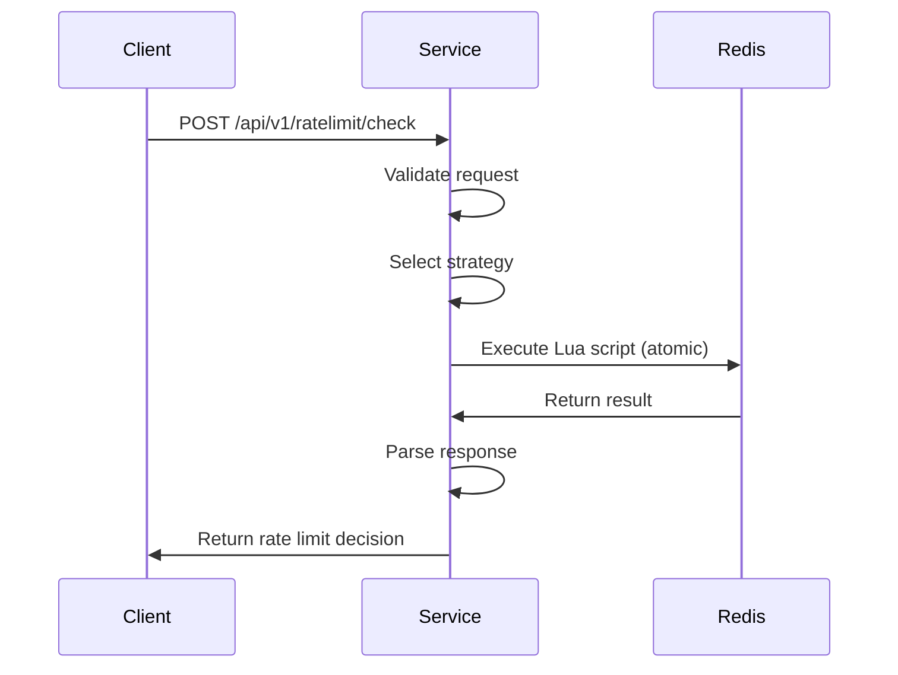

# Architecture

## System Overview

The distributed rate limiter is a stateless, horizontally scalable service that provides atomic rate limiting operations across multiple instances using Redis as the coordination layer.

```
┌─────────────────┐    ┌─────────────────┐    ┌─────────────────┐
│   Client App    │    │   Client App    │    │   Client App    │
└─────────┬───────┘    └─────────┬───────┘    └─────────┬───────┘
          │                      │                      │
          └──────────────────────┼──────────────────────┘
                                 │
                    ┌─────────────▼─────────────┐
                    │      Load Balancer       │
                    └─────────────┬─────────────┘
                                 │
          ┌──────────────────────┼──────────────────────┐
          │                      │                      │
┌─────────▼───────┐    ┌─────────▼───────┐    ┌─────────▼───────┐
│ Rate Limiter    │    │ Rate Limiter    │    │ Rate Limiter    │
│ Instance 1      │    │ Instance 2      │    │ Instance N      │
└─────────┬───────┘    └─────────┬───────┘    └─────────┬───────┘
          │                      │                      │
          └──────────────────────┼──────────────────────┘
                                 │
                    ┌─────────────▼─────────────┐
                    │        Redis             │
                    │   (Coordination Layer)   │
                    └───────────────────────────┘
```

## Core Components

### 1. Rate Limiter Service
- **Technology**: Java 17, Spring Boot 3.x
- **Responsibility**: HTTP API, request validation, algorithm orchestration
- **Scaling**: Stateless, horizontally scalable
- **Failure Mode**: Fail-open when Redis unavailable

### 2. Strategy Pattern Implementation
- **Interface**: `RateLimiterStrategy`
- **Implementations**: Token Bucket, Sliding Window Log, Fixed Window, Sliding Window Counter
- **Extensibility**: New algorithms can be added without changing core service

### 3. Redis Coordination Layer
- **Role**: Atomic state management across instances
- **Technology**: Redis with Lua scripts for atomicity
- **Data Model**: Algorithm-specific key patterns with TTL-based cleanup
- **Consistency**: Strong consistency within single Redis instance

### 4. Lua Script Engine
- **Purpose**: Atomic multi-operation transactions
- **Benefits**: Eliminates race conditions, reduces network round-trips
- **Scripts**: One per algorithm, optimized for performance

## Data Flow

### Request Processing Flow

```
1. HTTP Request → Rate Limiter Service
2. Request Validation (key, algorithm, limit, window, cost)
3. Strategy Selection (based on algorithm parameter)
4. Redis Lua Script Execution (atomic operation)
5. Response Generation (allowed/denied + metadata)
6. HTTP Response → Client
```

### Detailed Sequence



## Algorithm Implementations

### Token Bucket
- **Redis Keys**: `rate_limit:token_bucket:{key}`
- **Data**: `{tokens: number, lastRefill: timestamp}`
- **Atomicity**: Single Lua script handles refill + consumption

### Sliding Window Log
- **Redis Keys**: `rate_limit:sliding_window_log:{key}`
- **Data**: Sorted set of request timestamps
- **Cleanup**: TTL + periodic cleanup of old entries

### Fixed Window
- **Redis Keys**: `rate_limit:fixed_window:{key}:{windowId}`
- **Data**: Simple counter per window
- **Cleanup**: TTL-based, automatic window expiration

### Sliding Window Counter
- **Redis Keys**: 
  - `rate_limit:sliding_window_counter:{key}:{currentWindow}`
  - `rate_limit:sliding_window_counter:{key}:{previousWindow}`
- **Data**: Integer counters
- **Approximation**: Weighted sum with floor() function

## Consistency Model

### Strong Consistency
- **Scope**: Within single Redis instance
- **Mechanism**: Lua scripts execute atomically
- **Guarantee**: No race conditions between concurrent requests

### Eventual Consistency
- **Scope**: Across Redis replicas (if configured)
- **Trade-off**: Availability vs consistency
- **Mitigation**: Single Redis instance for critical applications

### Failure Handling
- **Redis Unavailable**: Fail-open (allow all requests)
- **Network Partition**: Graceful degradation
- **Recovery**: Automatic reconnection with exponential backoff

## Performance Characteristics

### Latency
- **Target**: <10ms p99 latency
- **Bottleneck**: Redis network round-trip
- **Optimization**: Lua scripts minimize Redis operations

### Throughput
- **Target**: 10,000+ RPS per instance
- **Scaling**: Horizontal scaling of service instances
- **Limitation**: Single Redis instance throughput

### Memory Usage
- **Token Bucket**: O(1) per key
- **Fixed Window**: O(1) per key
- **Sliding Window Counter**: O(1) per key (2 counters max)
- **Sliding Window Log**: O(n) per key (n = requests in window)

## Operational Considerations

### Monitoring
- **Metrics**: Request rates, latency, error rates, Redis health
- **Dashboards**: Grafana with pre-configured panels
- **Alerting**: Based on error rates and latency thresholds

### Deployment
- **Containerization**: Docker with multi-stage builds
- **Orchestration**: Kubernetes-ready with health checks
- **Configuration**: Environment-based with sensible defaults

### Security
- **Input Validation**: Comprehensive parameter validation
- **Key Sanitization**: Prevent Redis key injection
- **Rate Limiting**: Self-protection against abuse
- **Audit Logging**: Security event logging

## Scalability Patterns

### Horizontal Scaling
- **Service Instances**: Add more instances behind load balancer
- **Redis**: Single instance for consistency, Redis Cluster for scale
- **Stateless Design**: No local state, all coordination via Redis

### Vertical Scaling
- **Service**: Increase JVM heap, CPU cores
- **Redis**: Increase memory, optimize configuration
- **Network**: Higher bandwidth for Redis communication

### Geographic Distribution
- **Multi-Region**: Deploy service in multiple regions
- **Redis Replication**: Cross-region Redis replication
- **Trade-offs**: Latency vs consistency across regions

## Extension Points

### Adding New Algorithms
1. Implement `RateLimiterStrategy` interface
2. Create corresponding Lua script
3. Add algorithm to strategy registry
4. Write comprehensive tests

### Custom Metrics
- Implement `MeterRegistry` beans
- Add custom metrics in strategy implementations
- Export to monitoring systems

### Alternative Storage
- Implement alternative coordination layers
- Replace Redis with other distributed stores
- Maintain same consistency guarantees